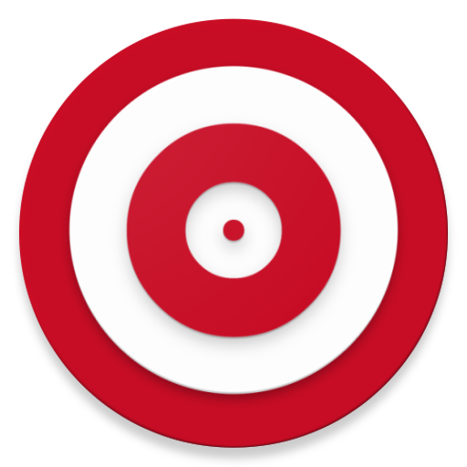
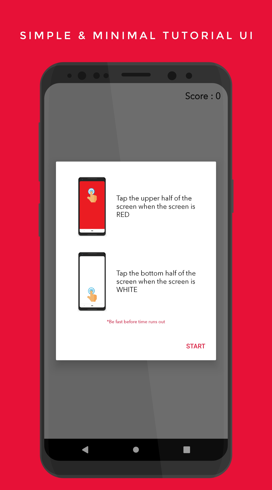
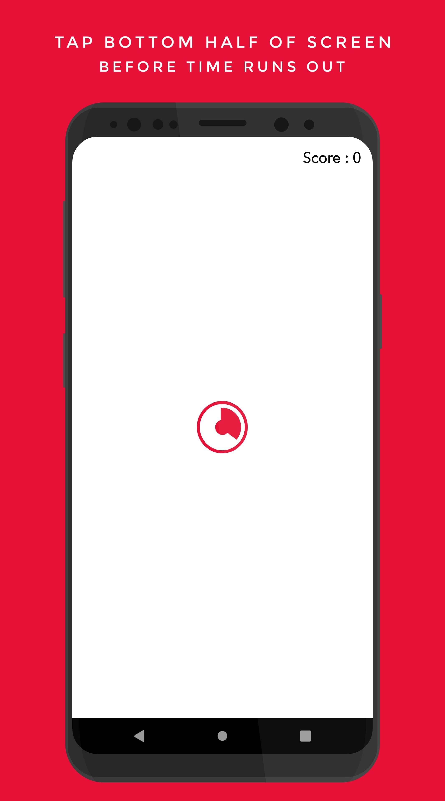
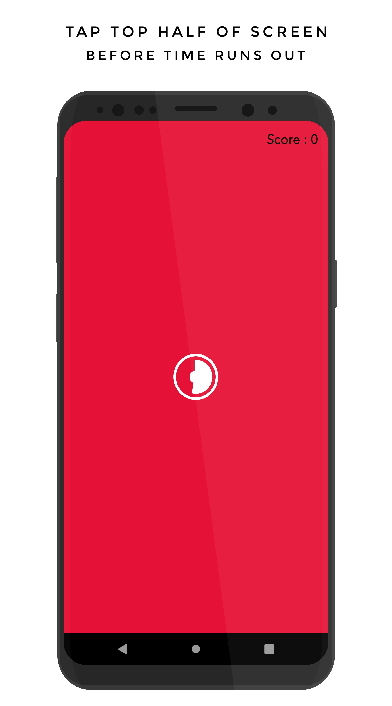
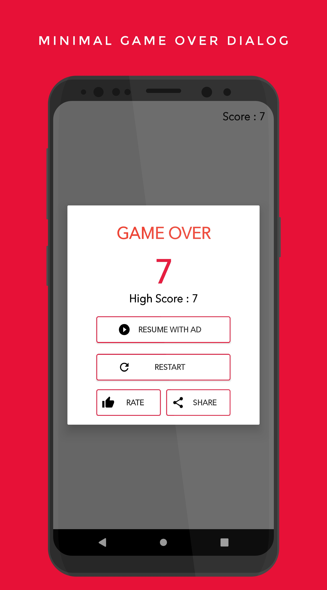
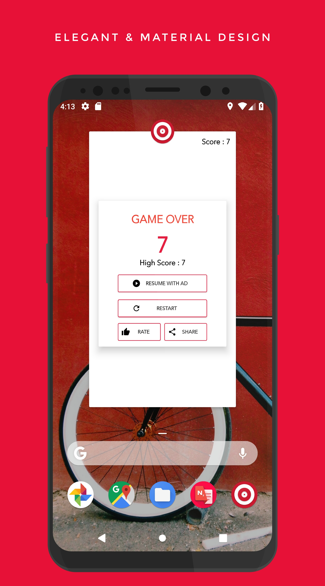

## RedHit

A simple & fast clicker game to chase high score.

<div style="display:flex;" >
<a href="https://play.google.com/store/apps/details?id=red.rednitrogen.hit.redhit">
    
</a>
</div>
</br></br>

## Screenshots
<div style="display:flex;" >






### Features
- Simple tutorial dialog
- Reflex based screen tap to score
- Resume with Ad , Restart
- Rate the app
- Share your score with a screenshot

## Libraries
[](https://github.com/HotBitmapGG/RingProgressBar)<br>
[](https://github.com/jraska/Falcon)<br>

### Support Development

[](https://www.buymeacoffee.com/sdnitrogen) <br> 
[](https://www.paypal.me/sdnitrogen)

## License
[](https://opensource.org/licenses/Apache-2.0)<br>
```
Copyright [2018] [Red Nitrogen , AssassiNCrizR]

   Licensed under the Apache License, Version 2.0 (the "License");
   you may not use this file except in compliance with the License.
   You may obtain a copy of the License at

     http://www.apache.org/licenses/LICENSE-2.0

   Unless required by applicable law or agreed to in writing, software
   distributed under the License is distributed on an "AS IS" BASIS,
   WITHOUT WARRANTIES OR CONDITIONS OF ANY KIND, either express or implied.
   See the License for the specific language governing permissions and
   limitations under the License.
```
